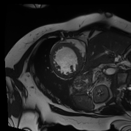
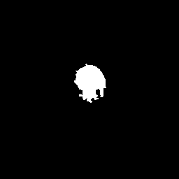

[](https://www.gnu.org/licenses/gpl-3.0)

# RegionGrowth - 2d or 3d region growing on gray scale images

## features

- Supports one seed or many seeds as the input of RegionGrowth algorithm

- Supports 2d region growth: RegionGrowth.RegionGrow2D
    - 4-neighbor
    - 8-neighbor

- Supports 3d region growth: RegionGrowth.RegionGrow3D
    - 6-neighbor
    - 26-neighbor

- Supports adaptive thresholding method by taking (mean±3*std) of foreground pixel values as thresholds

- Supports constant lower and upper thresholds


## install

```python
python setup.py build_ext
```

It will generate "RegionGrowth.xxx.pyd" in "./build" path, which can be imported in python.


## usage

```python
import RegionGrowth
RegionGrowth.RegionGrow2D(img, masks, upperThreshold=255, lowerThreshold=0, neighborMode="8n").main(seeds, update=True)
```

- `img`: np.ndarray[np.uint8, ndim=2] or np.ndarray[np.uint8, ndim=3] (only writeable array is supported).
- `masks`: same shape and type with `img`. determining whether pixels are required to be checked. If there are some given regions that doesn't contain foreground pixels, you can set corresponding masks to indicate that; otherwise, use `masks = np.ones_like(img)`. 
- `upperThreshold` and `lowerThreshold`: constant thresholds
- `neighborMode`: RegionGrow2D supports `"4n"` or `"8n"`; RegionGrow3D supports `"6n"` or `"26n"`;
- `seeds`: the coordinates of seeds `[(y,x)]`
- `update`: whether enable adaptive thresholding method by taking (mean±3*std) of foreground pixel values as thresholds.


## demo


```python
import RegionGrowth
import numpy as np
from PIL import Image


if __name__ == "__main__":
    img = Image.open("images/input.png").convert('L') # gray scale
    img = np.array(img)

    masks = np.ones_like(img)

    seed_img = Image.open("images/random.png").convert('L')
    seed_img = np.array(seed_img)
    coords = np.where(seed_img>0)

    seeds = np.stack(coords, axis=-1)

    out_img = RegionGrowth.RegionGrow2D(img, masks, upperThreshold=255, lowerThreshold=0, neighborMode="8n").main(seeds, update=True)
 
    out_img = Image.fromarray(np.asarray(out_img)*255)
    out_img.save("outputs/result_growth_pyx.png")
```


## results

### input image




### Ground-truth


### seeds


### output




-----------
2020-04-10
